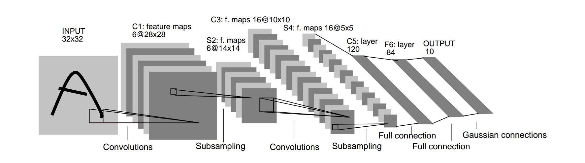

# lenet-python

The Repository contains simple implementation of lenet in python using **Keras** and **TensorFlow** as backend.

## Prerequisites:

keras need to be installed in your  working python environment. If not, run the following commands in your terminal

```
pip install numpy scipy
pip install scikit-learn
pip install pillow
pip install h5py
pip install tensorflow # OR your prefered backend
# for GPU users
# pip install tensorflow-gpu
pip install keras
```

To run the live demo using mouse, you need to have [OpenCV](http://opencv.org) installed in python.
Download and install instructions can be found at: http://opencv.org.

## Details

### lenet.py

It contains main lenet model as shown in following image.



The activation function that we are using is relu as it tends to give better result than thah function.

### check_digit.py

it contains the main training code. You can also draw input using mouse and check the output. It uses mnist database to train the model. If you are downloading it for the first time using keras, then it may take 1-2 minutes depending on your net speed.


To train the model first time, write the following command:
```
python check_digit.py --save-model 1 --weights output/lenet_weights.hdf5
```

The weights are saved to reuse them. To check input from mouse from pre trained model, use the following command:
```
python check_digit.py --load-model 1 --weights output/lenet_weights.hdf5
```

To draw on the screen, use left-click. When done drawing, use ESC to feed that as input to check which digit it corresponds to.


 

